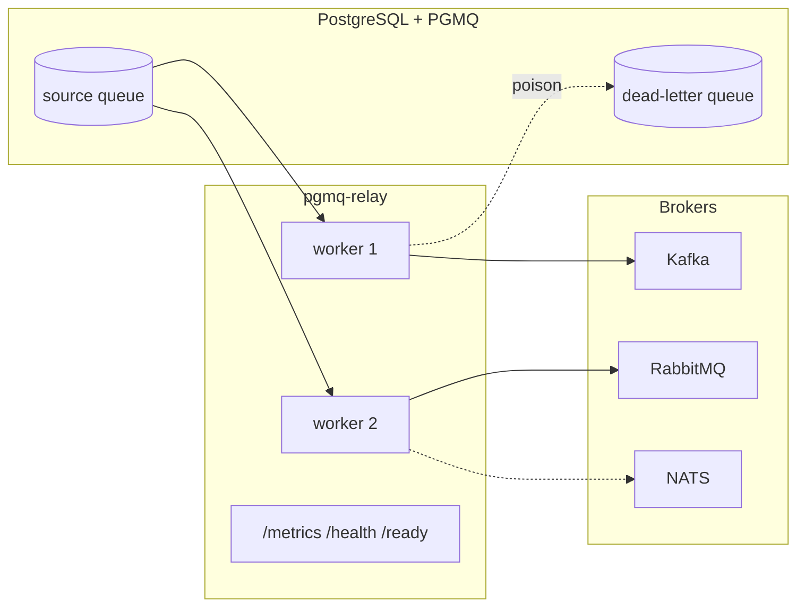

# PGMQ Relay

PGMQ Relay is a Rust service that reads messages from PGMQ queues and forwards them to message brokers such as Kafka, RabbitMQ, and NATS.

The relay is designed around at-least-once delivery. A worker reads a batch from PGMQ, transforms each message, sends successfully transformed messages to the configured broker, then deletes or archives only the messages that were delivered or dead-lettered.

## Features

- Multiple queues with per-queue parallelism.
- Kafka, RabbitMQ, and NATS broker support.
- Passthrough, JSON extraction, and template-based message transformation.
- Dead-letter routing for poison messages.
- Prometheus metrics plus `/health` and `/ready` endpoints.
- Config validation before startup.

## Architecture

